<!--
###############################################################################
# Copyright (c) 2026 IBM Corporation.
# All rights reserved. This program and the accompanying materials
# are made available under the terms of the Eclipse Public License 2.0
# which accompanies this distribution, and is available at
# http://www.eclipse.org/legal/epl-2.0/
# 
# SPDX-License-Identifier: EPL-2.0
#
# Contributors:
#     IBM Corporation - initial API and implementation
###############################################################################
-->

# Liberty Explorer Web UI - Architecture

## Overview

A web-based UI for exploring IBM Open Liberty installations, running as a Liberty web application. This tool extends the existing CLI functionality to provide interactive visualization and deep exploration of features, bundles, OSGi Declarative Services, configuration metadata, and their complex relationships.

## System Architecture

```mermaid
graph TB
    subgraph Liberty["Liberty Server"]
        subgraph WebApp["Liberty Explorer Web Application (WAR)"]
            subgraph Frontend["Frontend Layer"]
                React["React Application<br/>- Graph UI<br/>- Search<br/>- Filters<br/>- Details"]
            end
            
            subgraph API["REST API Layer (JAX-RS)"]
                FeatureAPI["Feature Endpoints"]
                BundleAPI["Bundle Endpoints"]
                ComponentAPI["DS Component Endpoints"]
                ConfigAPI["Config Endpoints"]
                SearchAPI["Search Endpoints"]
                GraphAPI["Graph Endpoints"]
            end
            
            subgraph Services["Service Layer"]
                ExplorerSvc["ExplorerService"]
                BundleAnalyzer["BundleAnalyzer"]
                DSParser["DSComponentParser"]
                MetaParser["MetatypeParser"]
                AutoAnalyzer["AutoFeatureAnalyzer"]
                RuntimeDetector["RuntimeStateDetector"]
                PkgScanner["PackageScanner"]
                ClassScanner["ClassScanner"]
            end
            
            subgraph DataModel["Data Model Layer"]
                Catalog["Catalog (from CLI)"]
                Feature["Feature (enhanced)"]
                Bundle["Bundle (enhanced)"]
                DSComponent["DSComponent (new)"]
                MetatypeInfo["MetatypeInfo (new)"]
                PackageInfo["PackageInfo (new)"]
                ClassInfo["ClassInfo (new)"]
                AutoTrigger["AutoFeatureTrigger (new)"]
            end
        end
        
        subgraph Runtime["Liberty Runtime (Optional)"]
            OSGi["OSGi APIs<br/>- Loaded features/bundles<br/>- Runtime state"]
        end
    end
    
    React -->|JSON| API
    API --> Services
    Services --> DataModel
    Services -.->|Optional| OSGi
```



## Technology Stack

### Backend
- **Framework**: Jakarta EE 10 (running on Liberty)
- **REST API**: JAX-RS (Jakarta RESTful Web Services)
- **JSON Processing**: Jackson or Jakarta JSON-B
- **Graph Library**: JGraphT (from existing CLI tool)
- **OSGi APIs**: For runtime state detection and DS component access
- **XML Parsing**: JAXB for metatype and DS component XML
- **Build Tool**: Gradle

### Frontend
- **Framework**: React 18+
- **Build Tool**: Vite (fast, modern)
- **Design System**: IBM Carbon Design System (@carbon/react)
- **Graph Visualization**: Cytoscape.js (best for complex dependency graphs)
- **State Management**: React Context API or Zustand
- **HTTP Client**: Fetch API
- **Deployment**: Built into WAR as static resources

### Build Integration
The frontend is built as part of the Gradle build process and bundled into the WAR file:

```gradle
task buildFrontend(type: Exec) {
    workingDir 'src/main/webapp/frontend'
    commandLine 'npm', 'run', 'build'
}

war {
    dependsOn buildFrontend
    from('src/main/webapp/frontend/dist') {
        into 'static'
    }
}
```

## Key Features

### 1. Feature Exploration
- List and search all features
- Visualize feature dependencies
- Show auto-feature trigger conditions
- Distinguish loaded vs installed features
- Interactive dependency graphs

### 2. Bundle Analysis
- Browse bundles and their contents
- Explore Java packages and classes
- View OSGi Declarative Services components
- Access configuration metadata (metatype)
- Display default configuration values

### 3. Auto-Feature Relationships
- Parse IBM-Provision-Capability LDAP filters
- Visualize trigger conditions (OR of ANDs)
- Show which features trigger which auto-features
- Interactive "what-if" analysis

### 4. Configuration Discovery
- Browse all configuration elements (metatype)
- Link DS components to their configuration PIDs
- Show default configuration from bundles
- Display attribute definitions and constraints

### 5. Runtime State Detection
- Distinguish installed vs loaded features/bundles
- Show active DS components
- Runtime state indicators throughout UI
- Optional OSGi integration

## Data Model

### Core Classes (from CLI tool)
Located in `../lx-main-ref/src/main/java/io/openliberty/inspect/`:
- `Catalog` - Main catalog of features and bundles
- `Feature` - Feature manifest representation
- `Bundle` - OSGi bundle representation
- `Element` - Base interface for features and bundles
- `Visibility` - Feature visibility enum

### New Classes

#### DSComponent
Represents an OSGi Declarative Services component:
```java
public class DSComponent {
    private String name;
    private String implementation;  // Java class
    private List<ProvidedService> providedServices;
    private List<ReferencedService> referencedServices;
    private String configurationPid;  // Links to MetatypeInfo
    private String configurationPolicy;  // optional, require, ignore
    private Bundle containingBundle;
    private Path componentXmlPath;
}
```

#### MetatypeInfo
Represents configuration metadata:
```java
public class MetatypeInfo {
    private String pid;  // Configuration PID
    private String factoryPid;  // For factory configurations
    private String name;
    private String description;
    private List<AttributeDefinition> attributes;
    private Bundle containingBundle;
    private List<DSComponent> relatedComponents;
    private Map<String, Object> defaultValues;
}
```

#### PackageInfo
Represents Java package information:
```java
public class PackageInfo {
    private String packageName;
    private List<String> classes;
    private boolean exported;
    private String version;
    private List<String> uses;  // Package dependencies
    private Bundle containingBundle;
}
```

#### ClassInfo
Represents an individual Java class:
```java
public class ClassInfo {
    private String className;  // Fully qualified name
    private String simpleName;
    private String packageName;
    private Bundle containingBundle;
    private boolean isInterface;
    private boolean isAbstract;
    private boolean isPublic;
    private List<String> annotations;
    private String superclass;
    private List<String> interfaces;
}
```

#### AutoFeatureTrigger
Represents auto-feature activation conditions:
```java
public class AutoFeatureTrigger {
    private Feature autoFeature;
    private List<TriggerCondition> conditions;  // OR of ANDs
    private String rawLdapFilter;
    
    public String describeActivation() {
        // "Activates when (servlet-4.0 AND cdi-2.0) OR (servlet-5.0 AND cdi-3.0)"
    }
}
```

### Enhanced Classes

#### Bundle (Enhanced)
Extended to support content exploration:
```java
public class Bundle {
    // Existing fields from CLI tool...
    
    // New fields
    private List<PackageInfo> exportedPackages;
    private List<PackageInfo> importedPackages;
    private List<DSComponent> components;
    private List<MetatypeInfo> metatypes;
    private Map<String, Object> defaultConfiguration;
    private boolean loaded;  // Runtime state
}
```

#### Feature (Enhanced)
Extended to support auto-feature relationships:
```java
public class Feature {
    // Existing fields from CLI tool...
    
    // New fields
    private List<AutoFeatureTrigger> triggeredBy;
    private List<Feature> triggers;
    private boolean loaded;  // Runtime state
}
```

## REST API Endpoints

### Feature Endpoints
- `GET /api/features` - List all features
- `GET /api/features/{symbolicName}` - Get feature details
- `GET /api/features/{symbolicName}/dependencies` - Get dependency graph
- `GET /api/features/{symbolicName}/triggers` - Get triggered auto-features
- `GET /api/features/auto` - List auto-features with conditions
- `GET /api/features/search?q={query}` - Search features

### Bundle Endpoints
- `GET /api/bundles` - List all bundles
- `GET /api/bundles/{symbolicName}` - Get bundle details
- `GET /api/bundles/{symbolicName}/packages` - List packages
- `GET /api/bundles/{symbolicName}/packages/{package}/classes` - List classes
- `GET /api/bundles/{symbolicName}/components` - List DS components
- `GET /api/bundles/{symbolicName}/metatypes` - List configuration metadata
- `GET /api/bundles/{symbolicName}/config/defaults` - Get default configuration

### DS Component Endpoints
- `GET /api/components` - List all DS components
- `GET /api/components/{name}` - Get component details
- `GET /api/components/{name}/services` - Get provided/referenced services
- `GET /api/components/{name}/config` - Get related configuration

### Configuration Endpoints
- `GET /api/config/elements` - List all config elements
- `GET /api/config/elements/{pid}` - Get config element details
- `GET /api/config/elements/{pid}/defaults` - Get default configuration
- `GET /api/config/elements/{pid}/components` - Get related DS components

### Class Endpoints
- `GET /api/classes` - List all classes (paginated)
  - Query params: `?bundle={name}&package={name}&limit={n}&offset={n}`
- `GET /api/classes/{fqn}` - Get class details by fully qualified name
  - Example: `/api/classes/com.ibm.ws.example.MyClass`
- `GET /api/classes/search?q={query}` - Search classes
  - Supports simple name or FQN search
  - Returns: class name, package, bundle, annotations

### Search Endpoints
- `GET /api/search?q={query}&type={type}` - Unified search across all types
  - Types: `feature`, `bundle`, `package`, `class`, `component`, `config`, `all`
- `GET /api/search/packages?q={query}` - Search packages by name
- `GET /api/search/classes?q={query}` - Search classes by name (simple or FQN)
  - Query params: `?q={query}&bundle={symbolicName}&package={packageName}`
- `GET /api/search/suggest?q={query}` - Get search suggestions

### Graph Endpoints
- `GET /api/graph/features?patterns={patterns}` - Feature dependency graph
- `GET /api/graph/autofeatures` - Auto-feature trigger graph
- `GET /api/graph/components?bundle={name}` - Component service graph

### Runtime Endpoints
- `GET /api/runtime/state` - Get runtime state summary
- `GET /api/runtime/features/loaded` - List loaded features
- `GET /api/runtime/bundles/loaded` - List loaded bundles

## Service Layer

### PackageScanner
Scans JAR files for packages and classes:
```java
@ApplicationScoped
public class PackageScanner {
    public List<PackageInfo> scanPackages(Bundle bundle);
    public List<String> getClassesInPackage(Bundle bundle, String packageName);
}
```

### ClassScanner
Scans and analyzes individual Java classes:
```java
@ApplicationScoped
public class ClassScanner {
    public List<ClassInfo> scanClasses(Bundle bundle);
    public ClassInfo getClassInfo(Bundle bundle, String className);
    public List<ClassInfo> searchClasses(String query);
    public List<ClassInfo> findClassesByAnnotation(String annotation);
}
```

### DSComponentParser
Parses OSGI-INF/*.xml files for DS components:
```java
@ApplicationScoped
public class DSComponentParser {
    public List<DSComponent> parseComponents(Bundle bundle);
}
```

### MetatypeParser
Parses OSGI-INF/metatype/*.xml files:
```java
@ApplicationScoped
public class MetatypeParser {
    public List<MetatypeInfo> parseMetatypes(Bundle bundle);
    public Map<String, Object> extractDefaults(MetatypeInfo metatype);
}
```

### AutoFeatureAnalyzer
Analyzes auto-feature trigger conditions:
```java
@ApplicationScoped
public class AutoFeatureAnalyzer {
    public List<AutoFeatureTrigger> analyzeAutoFeature(Feature feature);
    public List<Feature> findTriggeredAutoFeatures(Set<Feature> activeFeatures);
}
```

### RuntimeStateDetector
Detects runtime state via OSGi APIs:
```java
@ApplicationScoped
public class RuntimeStateDetector {
    public RuntimeState detectState();
    public boolean isFeatureLoaded(Feature feature);
}
```

## Frontend Architecture

### Project Structure
```
src/main/webapp/
├── frontend/                    # React source
│   ├── src/
│   │   ├── components/
│   │   │   ├── layout/
│   │   │   ├── graph/
│   │   │   ├── search/
│   │   │   ├── details/
│   │   │   ├── explorer/
│   │   │   └── common/
│   │   ├── services/
│   │   ├── hooks/
│   │   ├── context/
│   │   └── App.jsx
│   ├── public/
│   ├── package.json
│   └── vite.config.js
└── WEB-INF/
    └── web.xml
```

### Key UI Components

#### Interactive Graphs
- Feature dependency graph
- Auto-feature trigger graph (shows conditions)
- Component service graph
- Config-to-component graph
- Multiple layout algorithms
- Zoom, pan, selection
- Export to PNG/SVG

#### Search & Exploration
- Unified search across all types
- Type-ahead suggestions
- Advanced filters
- Package/class browser
- Component explorer
- Config explorer

#### Detail Panels
- Slide-out panels for selected items
- Tabbed interface
- Quick actions
- Copy/export functionality

#### State Indicators
- Visual distinction (loaded vs installed)
- Runtime status badges
- Auto-feature activation indicators

## Implementation Phases

### Phase 1: Foundation (Week 1)
- Set up Liberty web application structure
- Configure Gradle build with frontend integration
- Create basic REST API endpoints
- Implement simple React frontend
- Basic feature and bundle listing

### Phase 2: Enhanced Data Model (Weeks 2-3)
- Extend Bundle class with content access
- Implement PackageScanner
- Implement DSComponentParser
- Implement MetatypeParser
- Link components to config

### Phase 3: Auto-Feature Analysis (Week 4)
- Implement AutoFeatureAnalyzer
- Parse LDAP filters
- Build trigger condition model
- Create reverse index

### Phase 4: Runtime State Detection (Week 5)
- Implement RuntimeStateDetector
- Integrate with OSGi APIs
- Add state tracking
- Create runtime endpoints

### Phase 5: REST API Layer (Week 6)
- Complete all REST endpoints
- Add search functionality
- Implement graph endpoints
- API documentation

### Phase 6: Graph Visualization (Week 7)
- Integrate Cytoscape.js
- Implement graph types
- Add interactions
- Graph controls

### Phase 7: Search & Exploration UI (Week 8)
- Unified search
- Explorer views
- Detail panels
- Package/class browser

### Phase 8: Polish & Features (Week 9)
- Comparison views
- Advanced filtering
- Responsive design
- Performance optimization

### Phase 9: Testing & Documentation (Week 10)
- Test suite
- User documentation
- Deployment guide
- Performance tuning

## Deployment

### Development Mode
```bash
# Build frontend
cd src/main/webapp/frontend
npm install
npm run dev

# Run Liberty
./gradlew libertyDev

# Access at http://localhost:9080/liberty-explorer
```

### Production Build
```bash
./gradlew clean build
# Produces liberty-explorer.war with bundled frontend
```

### Server Configuration
```xml
<server>
    <featureManager>
        <feature>restfulWS-3.1</feature>
        <feature>jsonb-3.0</feature>
        <feature>cdi-4.0</feature>
        <feature>servlet-6.0</feature>
    </featureManager>
    
    <webApplication location="liberty-explorer.war" 
                    contextRoot="/liberty-explorer">
        <classloader delegation="parentLast"/>
    </webApplication>
</server>
```

## Reference to CLI Tool

The existing CLI tool code is available in the worktree at `../lx-main-ref/` for reference. Key classes to reuse:
- `Catalog` - Feature and bundle catalog
- `Feature` - Feature manifest parsing
- `Bundle` - Bundle manifest parsing
- `Element` - Base interface
- Graph utilities from `GraphCollectors`

## Security Considerations

1. **Read-only Access**: UI only reads Liberty installation
2. **Path Traversal**: Validate all paths stay within Liberty root
3. **Resource Limits**: Limit graph sizes and search results
4. **CORS**: Configure appropriately
5. **Authentication**: Optional Liberty security integration

## Performance Optimization

- Lazy loading of bundle contents
- Caching at service layer
- Pagination for large result sets
- Virtual scrolling in UI
- Web workers for heavy operations
- Incremental graph rendering

## Future Enhancements

1. Diff view for comparing installations
2. History tracking
3. Feature recommendations
4. Documentation export
5. Collaboration features
6. AI-powered natural language queries