# Liberty Explorer - Interface Design Specification

## Design Philosophy

**Primary Goal**: Create a search-first, exploration-focused interface that helps users discover and understand Liberty features, bundles, and their complex relationships through progressive disclosure.

**Key Principles**:
- **Search-First**: Unified search is the primary interaction pattern
- **Progressive Disclosure**: Start simple (features only), expand complexity as needed
- **Traceability**: Easy navigation up and down the hierarchy (features → bundles → classes → DS → config)
- **Accessibility**: Colorblind-friendly design with icons, patterns, and text labels
- **Phased Implementation**: Build incrementally (Phase 1: Features, Phase 2: Bundles, etc.)

---

## Overall Layout

### Master Layout Structure

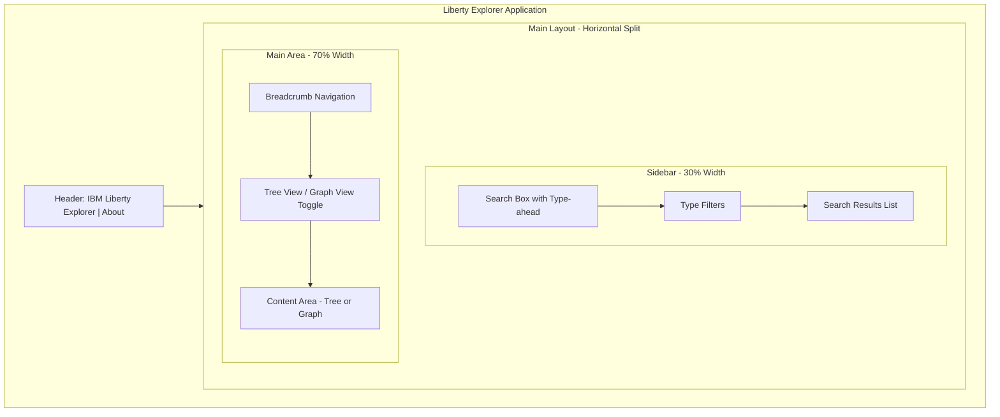

---

## Component Specifications

### 1. Header Component

**Carbon Components**: `Header`, `HeaderName`, `HeaderGlobalBar`, `HeaderGlobalAction`

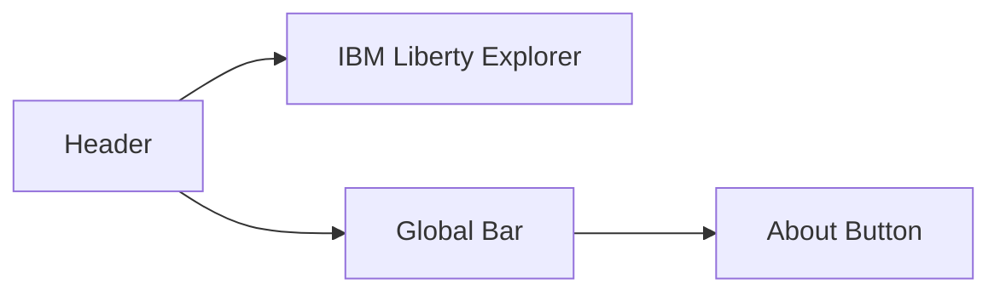

**Implementation**:
```jsx
<Header aria-label="IBM Liberty Explorer">
  <HeaderName href="#" prefix="IBM">
    Liberty Explorer
  </HeaderName>
  <HeaderGlobalBar>
    <HeaderGlobalAction aria-label="About" tooltipAlignment="end">
      <Information size={20} />
    </HeaderGlobalAction>
  </HeaderGlobalBar>
</Header>
```

---

### 2. Sidebar Components

#### 2.1 Search Box with Type-ahead

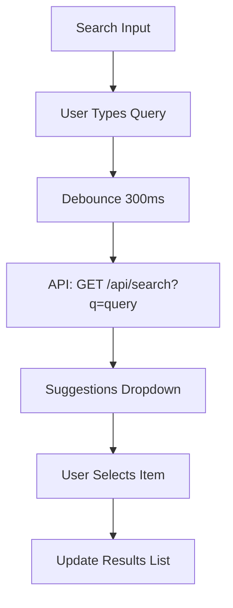

**Features**:
- Unified search across all types
- Fuzzy text matching
- Wildcard pattern support (glob, regex)
- Real-time suggestions as user types
- Debounced search (300ms)

**Carbon Component**: `Search`

#### 2.2 Type Filters

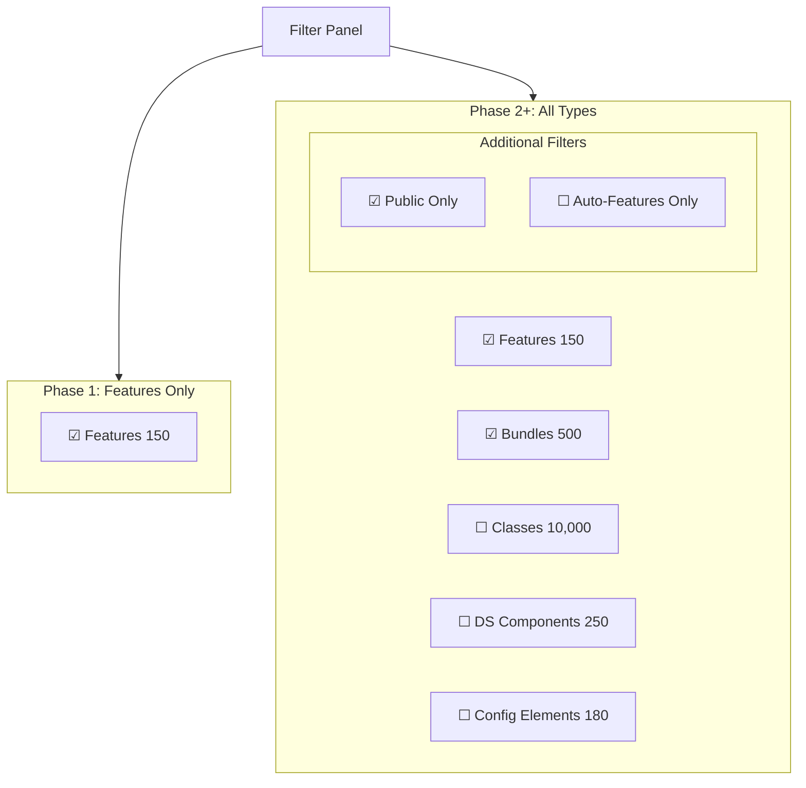

**Carbon Component**: `Checkbox` group or `FilterableMultiSelect`

#### 2.3 Search Results List

**Result Item Structure**:

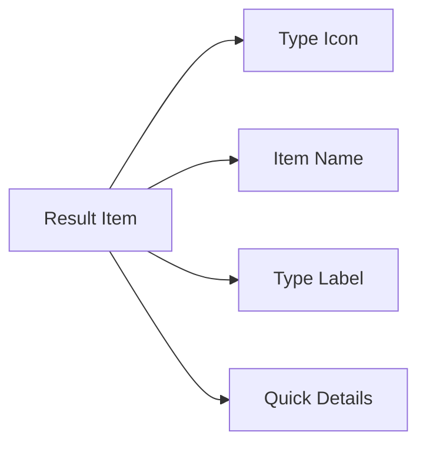

**Icons by Type** (Colorblind-Friendly):
- 🎯 Features (Target icon)
- 📦 Bundles (Package icon)
- 📄 Classes (Document icon)
- ⚙️ DS Components (Settings icon)
- 📝 Config Elements (Edit icon)

**Density Levels**:

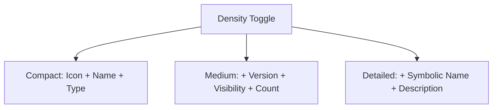

---

### 3. Main Area Components

#### 3.1 Breadcrumb Navigation

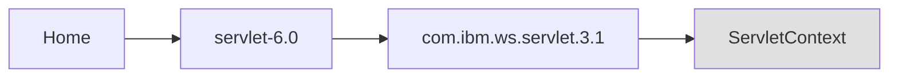

**Carbon Component**: `Breadcrumb`, `BreadcrumbItem`

**Purpose**: Show navigation path, allow quick navigation back

#### 3.2 View Toggle

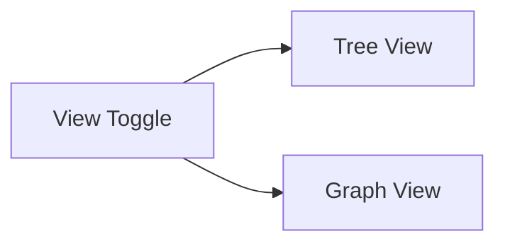

**Carbon Component**: `ContentSwitcher` with `Switch` components

---

### 4. Tree View Structure

#### Phase 1: Features Only

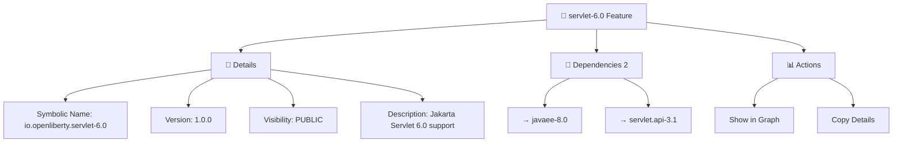

#### Phase 2: Features + Bundles

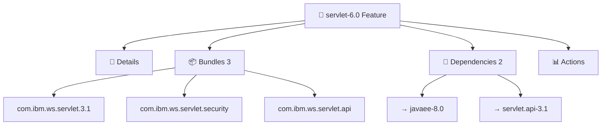

#### Phase 3+: Full Hierarchy

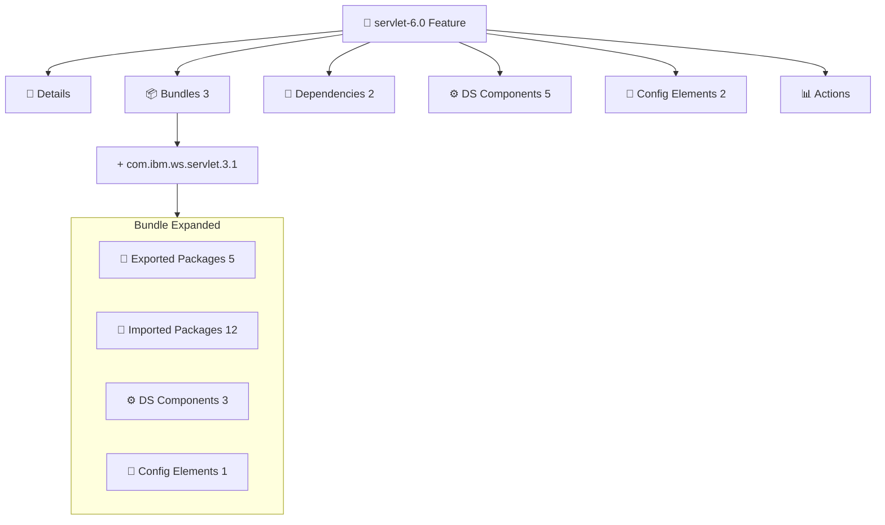

#### Tree Node Interactions

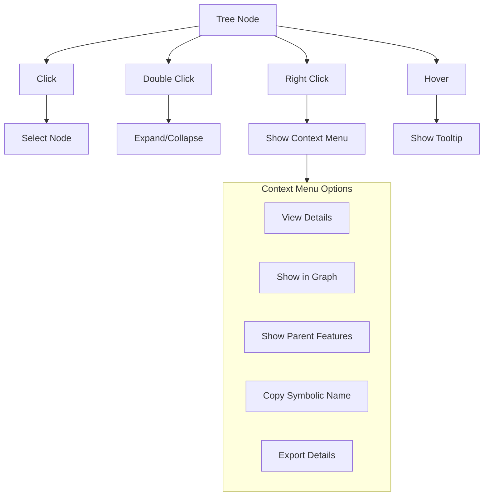

---

### 5. Graph View

#### 5.1 Graph Controls Panel

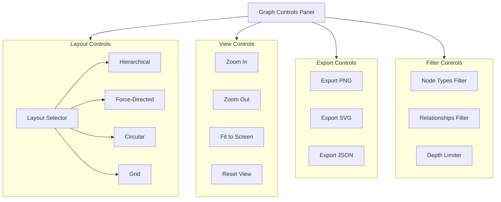

#### 5.2 Node and Edge Design

**Node Shapes** (Colorblind-Friendly):

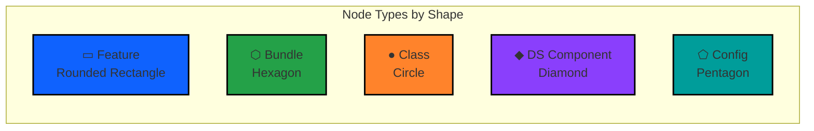

**Edge Types**:

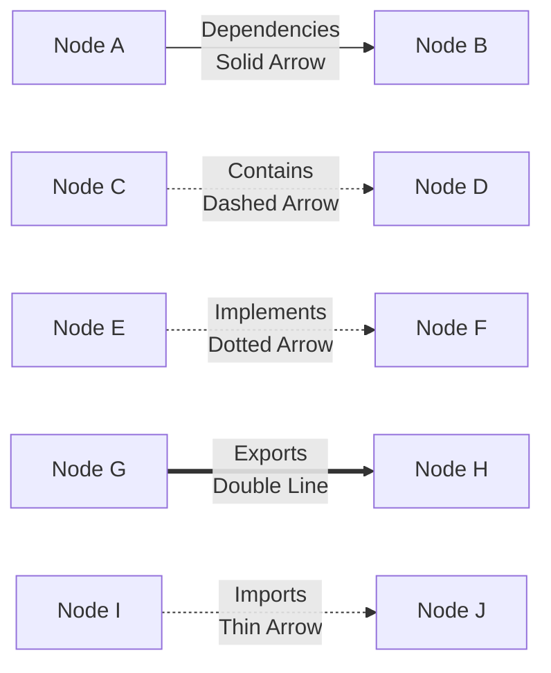

#### 5.3 Graph Interaction Model

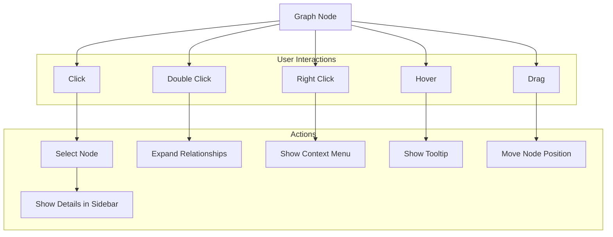

**Context Menu Options**:

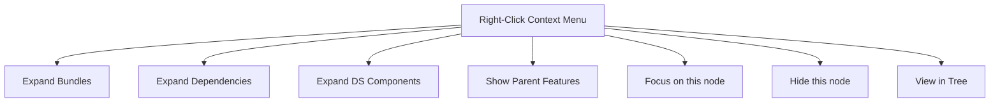

#### 5.4 Graph Filter Panel

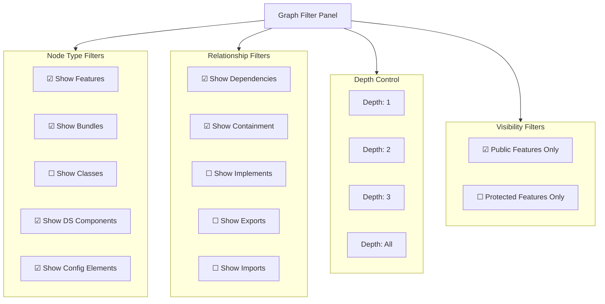

---

## Phased Implementation Roadmap

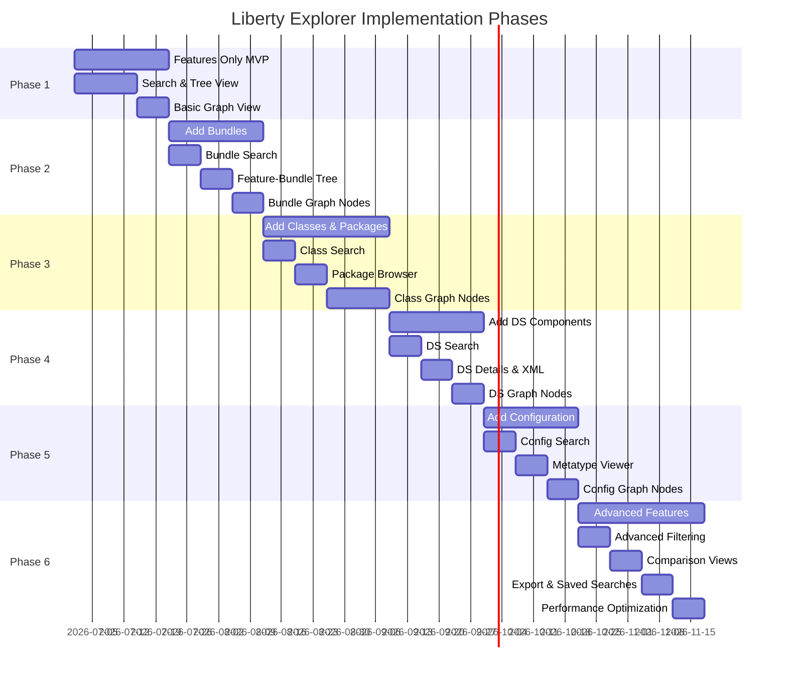

### Phase Details

#### Phase 1: Features Only (MVP Enhancement)

**Goal**: Enhance current MVP with search and basic graph

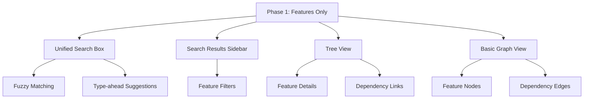

**Timeline**: 2-3 weeks

---

#### Phase 2: Add Bundles

**Goal**: Expand to show bundles and feature-bundle relationships

```mermaid
graph TD
    P2["Phase 2: Add Bundles"]
    
    BundleSearch["Bundle Search & Filtering"]
    FeatureBundleTree["Feature → Bundle Tree"]
    BundleFeatureTrace["Bundle → Feature Traceability"]
    BundleNodes["Bundle Nodes in Graph"]
    ContainmentEdges["Containment Edges"]
    
    P2 --> BundleSearch
    P2 --> FeatureBundleTree
    P2 --> BundleFeatureTrace
    P2 --> BundleNodes
    P2 --> ContainmentEdges
```

**Timeline**: 2-3 weeks

---

## Interaction Flow Diagrams

### Flow 1: Search and Explore Feature

```mermaid
sequenceDiagram
    actor User
    participant Search as Search Box
    participant API as Backend API
    participant Results as Results List
    participant Tree as Tree View
    participant Graph as Graph View
    
    User->>Search: Type "servlet"
    Search->>API: GET /api/search?q=servlet
    API-->>Search: Return suggestions
    Search-->>User: Show dropdown
    User->>Search: Select "servlet-6.0"
    Search->>Results: Update results
    Results-->>User: Show in list
    User->>Results: Click item
    Results->>Tree: Load feature details
    Tree-->>User: Display feature tree
    User->>Tree: Click "Show in Graph"
    Tree->>Graph: Switch to graph view
    Graph->>API: GET /api/graph/features?names=servlet-6.0
    API-->>Graph: Return graph data
    Graph-->>User: Display feature node
    User->>Graph: Double-click node
    Graph->>API: GET /api/features/servlet-6.0/dependencies
    API-->>Graph: Return dependencies
    Graph-->>User: Expand with dependency nodes
```

### Flow 2: Trace Class to Feature

```mermaid
sequenceDiagram
    actor User
    participant Search as Search Box
    participant Results as Results List
    participant Tree as Tree View
    participant Breadcrumb as Breadcrumb
    
    User->>Search: Type "ServletContext"
    Search-->>Results: Show class in results
    User->>Results: Click class
    Results->>Tree: Load class details
    Tree-->>User: Show class tree
    Note over Tree: Class Details<br/>Contained in Bundle: com.ibm.ws.servlet.3.1
    User->>Tree: Click bundle link
    Tree->>Tree: Navigate to bundle
    Tree-->>User: Show bundle tree
    Tree->>Breadcrumb: Update path
    Breadcrumb-->>User: Show: Home > ServletContext > com.ibm.ws.servlet.3.1
    Note over Tree: Bundle Details<br/>Contained in Features: servlet-6.0
    User->>Tree: Click feature link
    Tree->>Tree: Navigate to feature
    Tree-->>User: Show feature tree
    Tree->>Breadcrumb: Update path
    Breadcrumb-->>User: Show: Home > ServletContext > Bundle > servlet-6.0
```

### Flow 3: Filter and Visualize Graph

```mermaid
sequenceDiagram
    actor User
    participant Search as Search Box
    participant Filters as Filter Panel
    participant Graph as Graph View
    participant API as Backend API
    
    User->>Search: Type "servlet"
    Search-->>User: Show multiple results
    User->>Filters: Check "Features only"
    Filters-->>User: Results narrowed
    User->>Graph: Switch to Graph View
    Graph->>API: GET /api/graph/features?pattern=servlet*
    API-->>Graph: Return feature nodes
    Graph-->>User: Display feature nodes
    User->>Graph: Open filter panel
    User->>Filters: Check "Show Dependencies"
    Filters->>Graph: Update graph
    Graph->>API: GET dependencies for visible nodes
    API-->>Graph: Return dependency edges
    Graph-->>User: Display with edges
    User->>Graph: Select "Hierarchical" layout
    Graph-->>User: Reorganize graph
    User->>Graph: Double-click node
    Graph->>API: GET /api/features/{name}/dependencies
    API-->>Graph: Return related nodes
    Graph-->>User: Expand with new nodes
```

---

## Accessibility Requirements

### Colorblind-Friendly Design Strategy

```mermaid
graph TD
    Accessibility["Accessibility Strategy"]
    
    subgraph Visual["Visual Differentiation"]
        Icons["Unique Icons per Type"]
        Shapes["Different Node Shapes"]
        Patterns["Fill Patterns"]
        Borders["Border Styles"]
    end
    
    subgraph Text["Text Support"]
        Labels["Always Include Labels"]
        Tooltips["Descriptive Tooltips"]
        AltText["Alt Text for Icons"]
    end
    
    subgraph Keyboard["Keyboard Navigation"]
        TabNav["Tab Through Elements"]
        ArrowKeys["Arrow Keys for Trees"]
        Shortcuts["Keyboard Shortcuts"]
        Focus["Clear Focus Indicators"]
    end
    
    subgraph ScreenReader["Screen Reader Support"]
        ARIA["ARIA Labels"]
        LiveRegions["ARIA Live Regions"]
        Semantic["Semantic HTML"]
        Descriptions["Descriptive Link Text"]
    end
    
    Accessibility --> Visual
    Accessibility --> Text
    Accessibility --> Keyboard
    Accessibility --> ScreenReader
```

### Color and Pattern Combinations

```mermaid
graph LR
    subgraph ColorPatterns["Colorblind-Friendly Combinations"]
        F["Features<br/>Blue + Solid"]
        B["Bundles<br/>Green + Stripes"]
        C["Classes<br/>Orange + Dots"]
        D["DS Components<br/>Purple + Crosshatch"]
        E["Config<br/>Teal + Horizontal Lines"]
    end
    
    style F fill:#0f62fe,stroke:#000,stroke-width:3px
    style B fill:#24a148,stroke:#000,stroke-width:3px
    style C fill:#ff832b,stroke:#000,stroke-width:3px
    style D fill:#8a3ffc,stroke:#000,stroke-width:3px
    style E fill:#009d9a,stroke:#000,stroke-width:3px
```

---

## Carbon Design System Components

### Component Hierarchy

```mermaid
graph TD
    App["App Component"]
    
    subgraph Layout["Layout Components"]
        Header["Header"]
        Content["Content"]
        Grid["Grid"]
    end
    
    subgraph Sidebar["Sidebar Components"]
        Search["Search"]
        CheckboxGroup["Checkbox Group"]
        StructuredList["Structured List"]
    end
    
    subgraph MainArea["Main Area Components"]
        Breadcrumb["Breadcrumb"]
        ContentSwitcher["Content Switcher"]
        TreeView["Tree View Custom"]
        GraphView["Graph View Cytoscape"]
    end
    
    subgraph Common["Common Components"]
        Button["Button"]
        Tag["Tag"]
        Tooltip["Tooltip"]
        Loading["Loading"]
        Notification["Inline Notification"]
        Modal["Modal"]
        OverflowMenu["Overflow Menu"]
    end
    
    App --> Layout
    App --> Sidebar
    App --> MainArea
    App --> Common
```

### Required Carbon Components List

**Layout & Structure**:
- `Header`, `HeaderName`, `HeaderGlobalBar`, `HeaderGlobalAction`
- `Content`
- `Grid`, `Column`
- `Section`

**Navigation**:
- `Breadcrumb`, `BreadcrumbItem`
- `SideNav` (optional)

**Search & Filters**:
- `Search`
- `FilterableMultiSelect`
- `Checkbox`, `CheckboxGroup`
- `Dropdown`, `MultiSelect`
- `Toggle`

**Lists & Display**:
- `StructuredList`, `StructuredListWrapper`, `StructuredListHead`, `StructuredListBody`, `StructuredListRow`, `StructuredListCell`
- `DataTable` (for detailed views)
- `Tile`, `ClickableTile`
- `Tag`

**Controls**:
- `Button`
- `ContentSwitcher`, `Switch`
- `Tabs`, `Tab`
- `Slider`

**Feedback**:
- `Tooltip`
- `Loading`
- `InlineNotification`
- `Modal`

**Menus**:
- `OverflowMenu`, `OverflowMenuItem`

---

## Technical Implementation Notes

### State Management Structure

```mermaid
graph TD
    AppState["Application State"]
    
    subgraph SearchState["Search State"]
        Query["query: string"]
        Results["results: SearchResult[]"]
        Filters["filters: FilterState"]
    end
    
    subgraph NavigationState["Navigation State"]
        CurrentView["currentView: 'tree' | 'graph'"]
        SelectedItem["selectedItem: Item | null"]
        BreadcrumbPath["breadcrumb: BreadcrumbItem[]"]
    end
    
    subgraph GraphState["Graph State"]
        Nodes["nodes: Node[]"]
        Edges["edges: Edge[]"]
        Layout["layout: string"]
        GraphFilters["filters: GraphFilters"]
    end
    
    subgraph TreeState["Tree State"]
        ExpandedNodes["expandedNodes: Set<string>"]
        SelectedNode["selectedNode: string | null"]
    end
    
    AppState --> SearchState
    AppState --> NavigationState
    AppState --> GraphState
    AppState --> TreeState
```

### Performance Optimization Strategy

```mermaid
graph TD
    Performance["Performance Optimization"]
    
    subgraph Search["Search Optimization"]
        Debounce["Debounce Input 300ms"]
        LimitResults["Limit Results max 100 per type"]
        VirtualScroll["Virtual Scrolling"]
    end
    
    subgraph Graph["Graph Optimization"]
        LazyLoad["Lazy Load Nodes"]
        LimitNodes["Limit Visible Nodes max 500"]
        Progressive["Progressive Rendering"]
        WebWorkers["Web Workers for Layout"]
    end
    
    subgraph Tree["Tree Optimization"]
        LazyChildren["Lazy Load Children"]
        VirtualTree["Virtual Scrolling"]
        Memoization["Memoize Rendered Nodes"]
    end
    
    subgraph Caching["Caching Strategy"]
        APICache["Cache API Responses"]
        LocalStorage["Local Storage for Preferences"]
        SessionCache["Session Cache for Search"]
    end
    
    Performance --> Search
    Performance --> Graph
    Performance --> Tree
    Performance --> Caching
```

---

## API Integration

### Required API Endpoints

```mermaid
graph TD
    API["Backend API"]
    
    subgraph Phase1["Phase 1: Features"]
        SearchAPI["GET /api/search?q=query&types=features"]
        FeaturesAPI["GET /api/features"]
        FeatureDetailAPI["GET /api/features/{name}"]
        FeatureDepsAPI["GET /api/features/{name}/dependencies"]
        GraphFeaturesAPI["GET /api/graph/features?names=name1,name2"]
    end
    
    subgraph Phase2["Phase 2: Bundles"]
        BundlesAPI["GET /api/bundles"]
        BundleDetailAPI["GET /api/bundles/{name}"]
        BundleFeaturesAPI["GET /api/bundles/{name}/features"]
        GraphBundlesAPI["GET /api/graph/bundles?names=name1,name2"]
    end
    
    subgraph Phase3["Phase 3+: Classes, DS, Config"]
        ClassesAPI["GET /api/classes?bundle=name&package=name"]
        ClassDetailAPI["GET /api/classes/{fqn}"]
        DSAPI["GET /api/components"]
        ConfigAPI["GET /api/config/elements"]
    end
    
    API --> Phase1
    API --> Phase2
    API --> Phase3
```

---

## Summary

This interface design provides:

1. **Search-First Experience**: Unified search as primary interaction
2. **Progressive Disclosure**: Start simple (features), reveal complexity as needed
3. **Dual Views**: Tree for hierarchy, Graph for relationships
4. **Comprehensive Traceability**: Navigate up and down the stack
5. **Accessibility**: Colorblind-friendly with icons, patterns, and labels
6. **Phased Implementation**: Build incrementally from features to full system
7. **Carbon Design System**: Consistent IBM design language
8. **Flexible Filtering**: Control visibility at global and node level

The design balances power-user needs (comprehensive filtering, graph visualization) with ease of learning (simple search, progressive disclosure, helpful defaults).