# Liberty Explorer - Visual Mockups

This document provides detailed visual mockups for each implementation phase of the Liberty Explorer interface.

---

## Phase 1: Features Only - Initial State

### Mockup 1.1: Welcome Screen (Before Search)

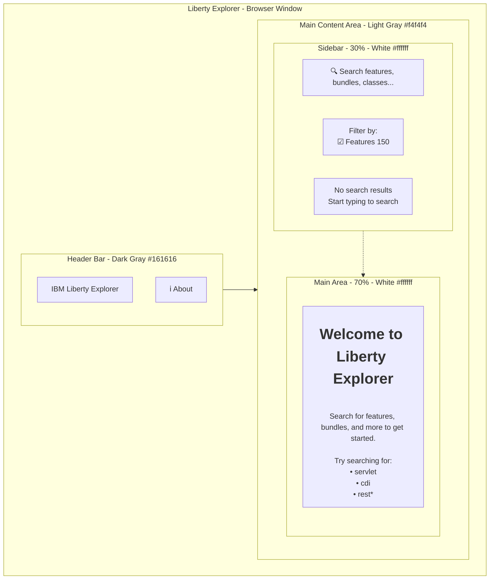

---

## Phase 1: Features Only - Search Results

### Mockup 1.2: Search Results with Compact View

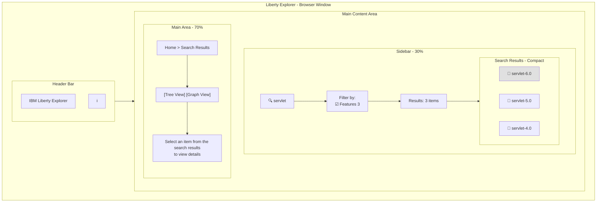

### Mockup 1.3: Search Results with Medium Density

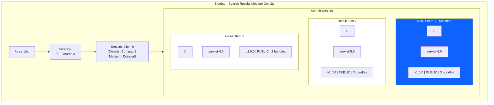

---

## Phase 1: Tree View

### Mockup 1.4: Tree View - Feature Details

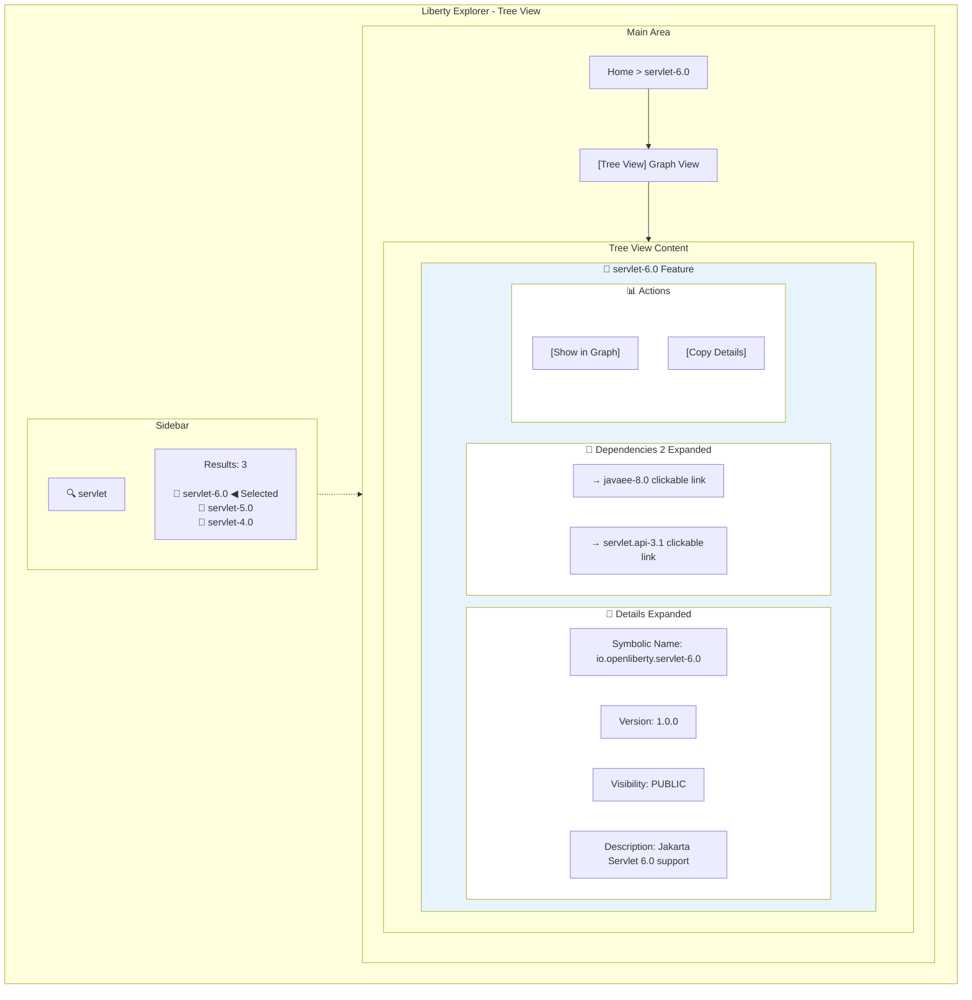

### Mockup 1.5: Tree View - Hover Tooltip

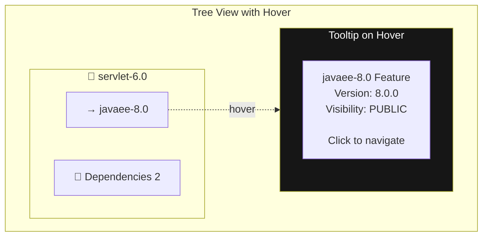

---

## Phase 1: Graph View

### Mockup 1.6: Graph View - Basic Feature Dependencies

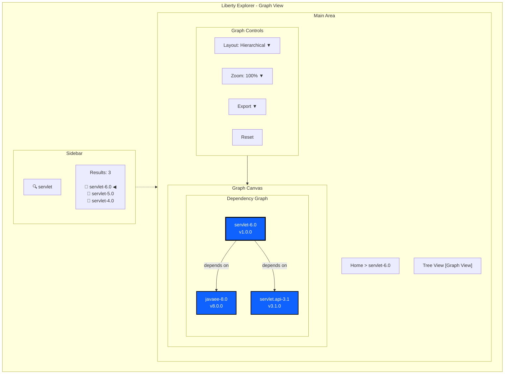

### Mockup 1.7: Graph View - With Filter Panel

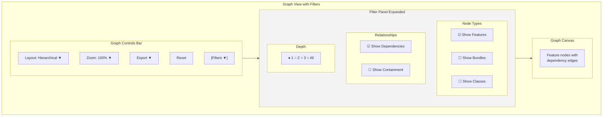

### Mockup 1.8: Graph View - Node Context Menu

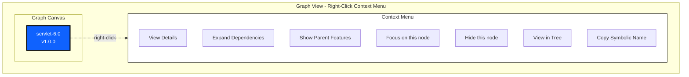

---

## Phase 2: Features + Bundles

### Mockup 2.1: Search Results - Mixed Types

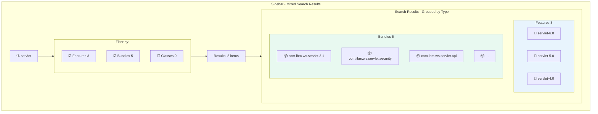

### Mockup 2.2: Tree View - Feature with Bundles

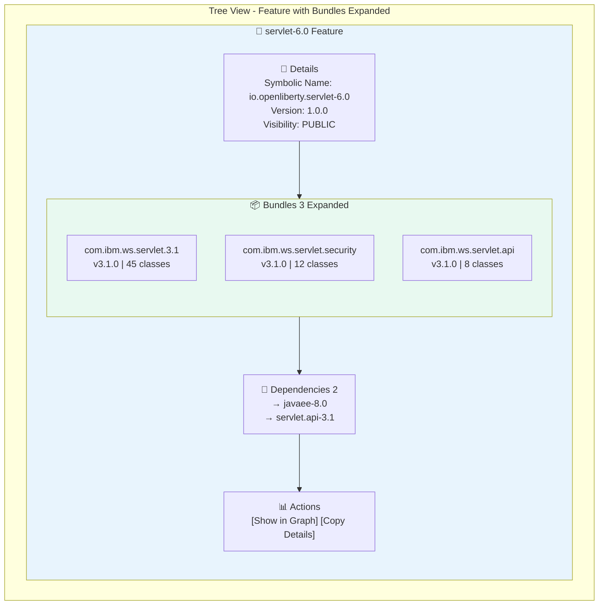

### Mockup 2.3: Tree View - Bundle Details with Traceability

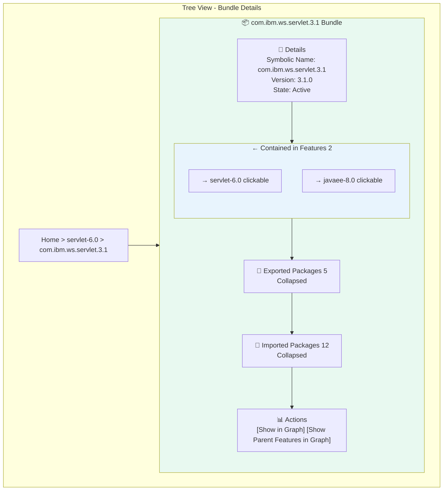

### Mockup 2.4: Graph View - Features and Bundles

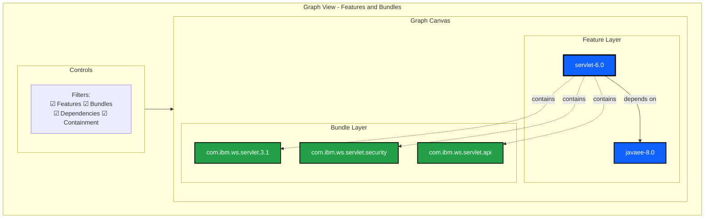

---

## Phase 3: Classes and Packages

### Mockup 3.1: Search Results - All Types

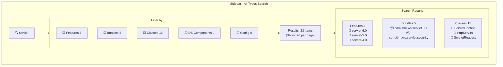

### Mockup 3.2: Tree View - Class Details with Full Traceability

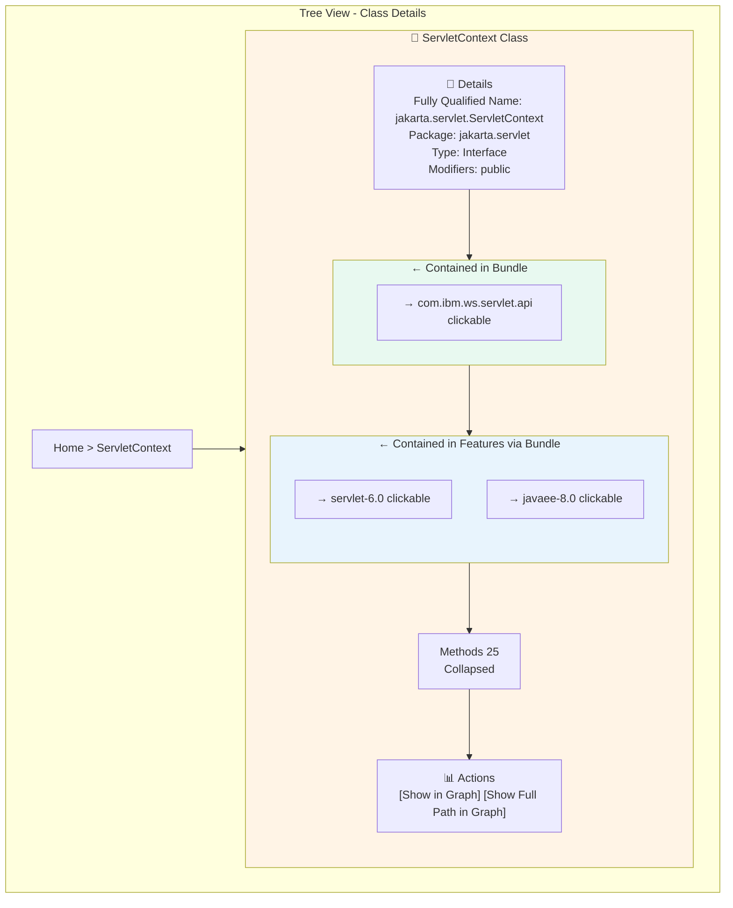

---

## Responsive Behavior

### Mockup R.1: Mobile/Tablet Layout

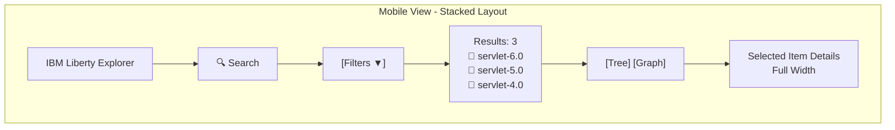

---

## Dark Mode Support

### Mockup D.1: Dark Mode Color Scheme

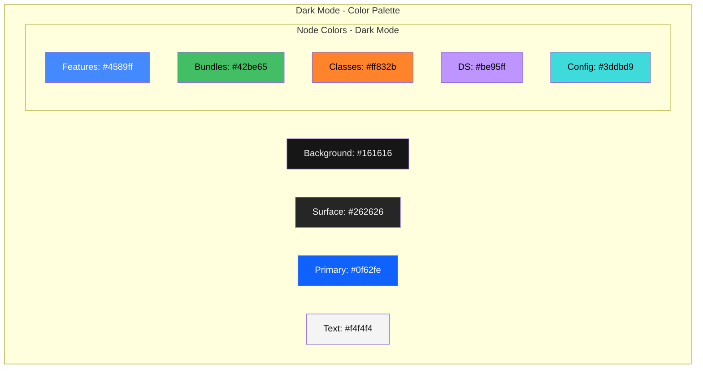

---

## Loading States

### Mockup L.1: Loading States

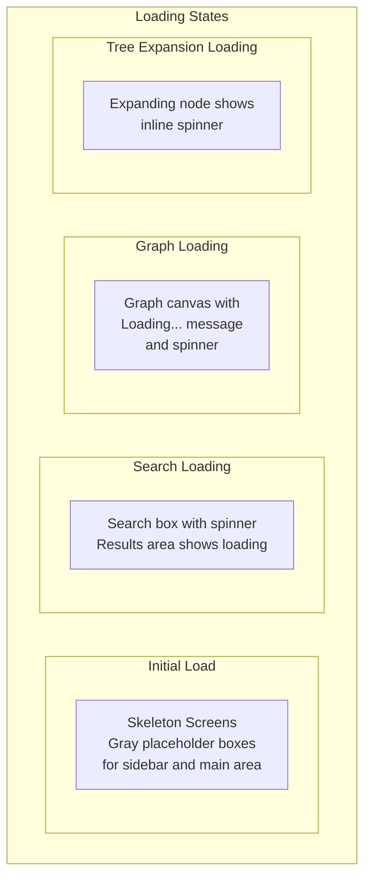

---

## Error States

### Mockup E.1: Error Handling

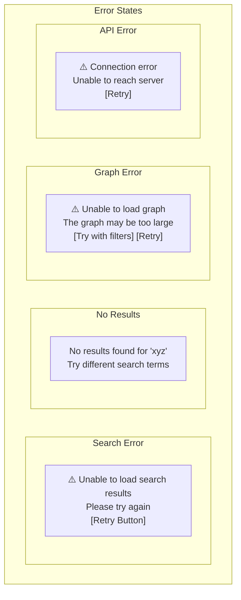

---

## Summary

These mockups illustrate:

1. **Progressive Enhancement**: From simple feature list to complex multi-type exploration
2. **Consistent Layout**: Sidebar + Main area pattern throughout
3. **Clear Visual Hierarchy**: Icons, colors, and spacing guide the eye
4. **Traceability**: Breadcrumbs and clickable links show relationships
5. **Flexible Views**: Tree for hierarchy, Graph for relationships
6. **Responsive Design**: Adapts to different screen sizes
7. **Accessibility**: Clear labels, icons, and color-independent indicators
8. **Error Handling**: Graceful degradation with helpful messages

All mockups follow Carbon Design System principles and maintain consistency across phases.